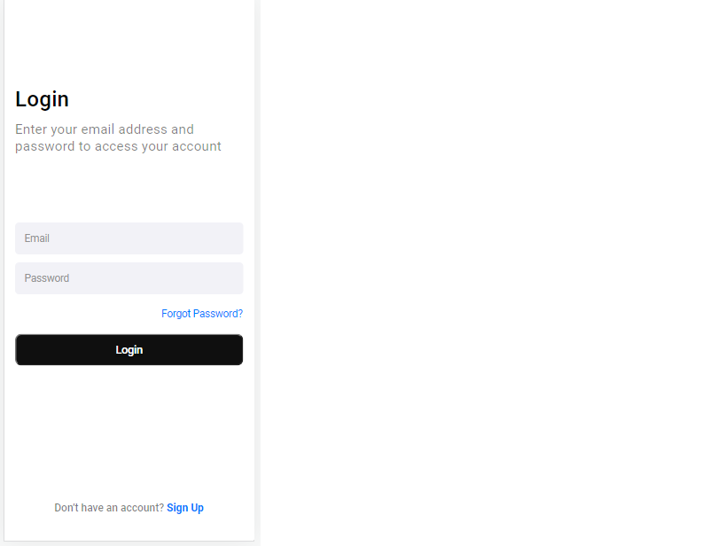

# Third-challenge

> Terceiro desafio do curso de programação do CodeClub utilizando HTML e CSS.

### Ajustes e melhorias

O projeto ainda está em desenvolvimento e as próximas atualizações serão voltadas nas seguintes tarefas:

- [x] HTML
- [x] CSS
- [ ] JavaScript

## 🤝 Colaboradores

Agradecemos às seguintes pessoas que contribuíram para este projeto:

<table>
  <tr>
    <td align="center">
      <a href="#">
         
        
          <b>Isadora Ribeiro</b>
        
      </a>
    </td>
    <td align="center">
      <a href="#">
         
        
          <b>CodeClub</b>
        
      </a>
    </td>
   
  </tr>
</table>

